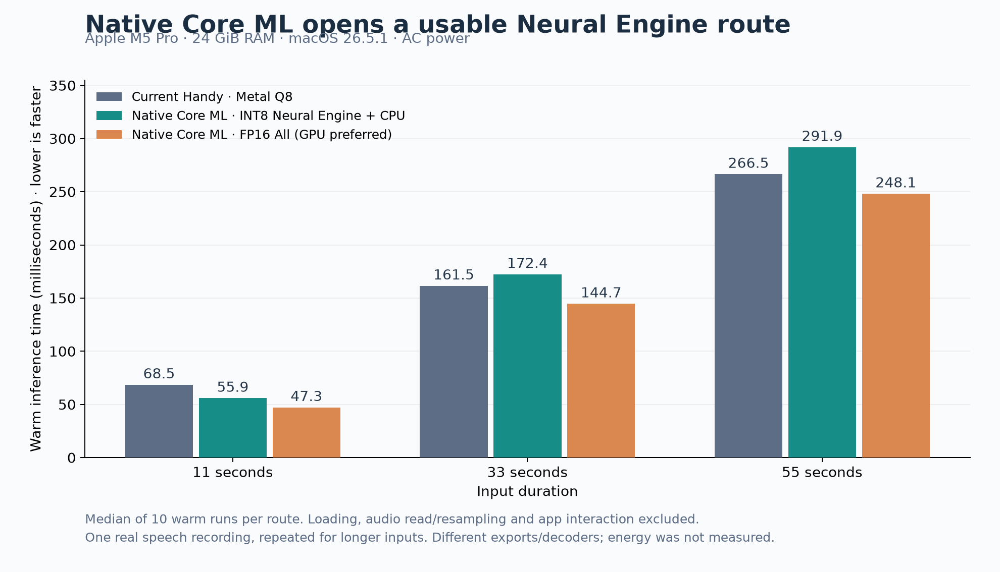

# Build Instructions

This guide covers how to set up the development environment and build Handy from source across different platforms.

## Prerequisites

### All Platforms

- [Rust](https://rustup.rs/) (latest stable)
- [Bun](https://bun.sh/) package manager
- [Tauri Prerequisites](https://tauri.app/start/prerequisites/)

### Platform-Specific Requirements

#### macOS

- Xcode Command Line Tools
- Install with: `xcode-select --install`

##### Intel Mac (x86_64)

Prebuilt ONNX Runtime binaries are not available for Intel Macs. Install ONNX Runtime via Homebrew and link dynamically:

```bash
brew install onnxruntime
ORT_LIB_LOCATION=$(brew --prefix onnxruntime)/lib ORT_PREFER_DYNAMIC_LINK=1 bun run tauri dev
```

The same environment variables apply for production builds:

```bash
ORT_LIB_LOCATION=$(brew --prefix onnxruntime)/lib ORT_PREFER_DYNAMIC_LINK=1 bun run tauri build
```

#### Windows

- Microsoft C++ Build Tools: Visual Studio 2019/2022 with C++ development
  tools, or Visual Studio Build Tools 2019/2022
- [CMake](https://cmake.org/download/) (must be on `PATH`):

  ```powershell
  winget install Kitware.CMake
  ```

- [Vulkan SDK](https://vulkan.lunarg.com/sdk/home) from LunarG — required to
  build the Vulkan GPU backend (`vulkan-shaders-gen` needs the SDK's headers
  and `glslc`):

  ```powershell
  winget install KhronosGroup.VulkanSDK
  ```

  Open a new terminal afterward so `VULKAN_SDK` is set.

> [!NOTE]
> Windows' 260-character path limit used to break the native Vulkan build in
> most checkouts. Since `transcribe-cpp` 0.1.3 the build works around it
> automatically (it compiles through a short NTFS junction — no admin rights
> or setup needed), so a normal checkout just builds. If you still hit
> path-limit errors, see
> [Windows build fails with path-limit errors](#windows-build-fails-with-path-limit-errors-msb3491--ftk1011--msb6003)
> in Troubleshooting.

#### Linux

- Build essentials
- ALSA development libraries
- Install with:

  ```bash
  # Ubuntu/Debian
  sudo apt update
  sudo apt install build-essential clang libclang-dev libevdev-dev libasound2-dev pkg-config libssl-dev libvulkan-dev vulkan-tools glslc spirv-headers glslang-tools libgtk-3-dev libwebkit2gtk-4.1-dev libayatana-appindicator3-dev librsvg2-dev libgtk-layer-shell0 libgtk-layer-shell-dev patchelf cmake

  # Fedora/RHEL
  sudo dnf groupinstall "Development Tools"
  sudo dnf install alsa-lib-devel pkgconf openssl-devel vulkan-devel glslc \
    clang clang-devel libevdev-devel \
    spirv-headers-devel spirv-tools-devel glslang \
    gtk3-devel webkit2gtk4.1-devel libappindicator-gtk3-devel librsvg2-devel \
    gtk-layer-shell gtk-layer-shell-devel \
    cmake

  # Arch Linux
  sudo pacman -S base-devel clang libevdev shaderc spirv-headers glslang alsa-lib pkgconf openssl vulkan-devel \
    gtk3 webkit2gtk-4.1 libappindicator-gtk3 librsvg gtk-layer-shell \
    cmake
  ```

## Setup Instructions

### 1. Clone the Repository

```bash
git clone git@github.com:cjpais/Handy.git
cd Handy
```

### 2. Install Dependencies

```bash
bun install
```

### 3. Start Dev Server

```bash
bun tauri dev
```

### 4. Build for Production

```bash
bun run tauri build
```

This compiles a release binary and generates platform-specific bundles (deb, rpm, AppImage on Linux; dmg on macOS; msi on Windows).

## Linux Install (from source)

The raw binary (`src-tauri/target/release/handy`) cannot run standalone — it needs Tauri resource files (tray icons, sounds, VAD model) to be co-located at the expected path.

**Install from the deb bundle** (works on any Linux distro):

```bash
cd /tmp
ar x /path/to/Handy/src-tauri/target/release/bundle/deb/Handy_*_amd64.deb data.tar.gz
tar xzf data.tar.gz
sudo cp usr/bin/handy /usr/bin/
sudo cp -a usr/lib/. /usr/lib/
sudo cp -r usr/share/icons/hicolor/* /usr/share/icons/hicolor/
sudo cp usr/share/applications/Handy.desktop /usr/share/applications/
```

The runtime libraries live in the app-private `/usr/lib/Handy/` (on the binary's rpath), so no `ldconfig` step is needed.

After subsequent rebuilds, copy the binary and any refreshed runtime libraries:

```bash
sudo cp src-tauri/target/release/handy /usr/bin/
sudo mkdir -p /usr/lib/Handy
sudo cp -a src-tauri/transcribe-libs/. /usr/lib/Handy/
```

Resources only need re-copying if they change upstream (new icons, sounds, models, etc.).

## Troubleshooting

### Apple Silicon Core ML acceleration (local build)

Apple Silicon builds expose **Core ML (All Apple Hardware)** and
**Neural Engine + CPU (Core ML)** under Advanced > ONNX Acceleration when the
linked ONNX Runtime reports CoreMLExecutionProvider. MLProgram requires macOS 12
or later. These modes apply to ONNX models, not GGUF models, which retain Metal.
Core ML is opt-in because operator coverage, dynamic shapes and int8 graphs can
make it slower than CPU. CPU handles unsupported operators even in Neural Engine
mode. Selecting a mode does not guarantee that every operation uses the ANE.

The compiled model cache lives in the app cache directory under `coreml/`.
Cache namespaces include model/companion file contents and compute-unit choice,
so replacing model weights in place does not reuse stale compiled models.
The first compilation can take substantially longer than subsequent loads.

Benchmark without changing the saved model or acceleration setting:

```bash
/Applications/Handy.app/Contents/MacOS/handy --transcribe-file sample.wav --model moonshine-base --ort-accelerator cpu --repeat 3 --json
/Applications/Handy.app/Contents/MacOS/handy --transcribe-file sample.wav --model moonshine-base --ort-accelerator coreml --repeat 3 --json
/Applications/Handy.app/Contents/MacOS/handy --transcribe-file sample.wav --model moonshine-base --ort-accelerator coreml_neural_engine --repeat 3 --json
```

The model must already be downloaded. Compare the same audio and model, including
first-run versus warm latency and transcript quality. JSON's `bound_backend: onnx`
identifies the engine, not the hardware assignment of every ONNX node. For Core ML
compute-plan diagnostics, set `HANDY_COREML_PROFILE=1` on a benchmark invocation.
The local `transcribe-rs` patch and its provenance are documented in
`src-tauri/vendor/transcribe-rs/HANDY-PATCH.md`.

Local benchmark on 2026-10-02: M5 Pro, 24 GiB RAM, macOS 26.5.1, connected to AC
power throughout the reported batch. The public whisper.cpp JFK sample was
repeated to create 11-, 33-, and 55-second inputs. Each configuration had two
process trials, each containing one first inference followed by five warm runs.
Values below are the median of the ten warm measurements, in milliseconds.

| Model and backend                              | 11s audio | 33s audio | 55s audio |
| ---------------------------------------------- | --------: | --------: | --------: |
| Moonshine Base ONNX CPU                        |       164 |       602 |    2776.5 |
| Moonshine Base Core ML, all hardware           |     237.5 |      1121 |    3434.5 |
| Moonshine Base Core ML, CPU + Neural Engine    |     230.5 |     889.5 |      3305 |
| Parakeet Unified Q8 GGUF CPU                   |     317.5 |    1354.5 |      1987 |
| Parakeet Unified Q8 GGUF Metal, modified build |        62 |     149.5 |       222 |
| Parakeet Unified Q8 GGUF Metal, original build |        66 |     147.5 |       222 |

Core ML did not improve this ONNX model. Cached loads took approximately
2.8–3.5 seconds, compared with 0.32–0.36 seconds for CPU. At 33 seconds, maximum
main-process RSS was 1.34 GiB on CPU, 4.05 GiB with all Core ML compute units,
and 3.31 GiB with CPU + Neural Engine. A separate fresh-cache 11-second trial
loaded in 4.37 seconds (all compute units) or 3.89 seconds (CPU + Neural Engine).
The existing cache and selected model/accelerator settings were preserved.

Moonshine produced identical normalized words across all three backends at each
duration. At 11 and 33 seconds they matched the expected words. At 55 seconds
all Moonshine backends overgenerated repetitions (220 word edits against the
115-word reference), so those timings include abnormal decoding behavior.
Parakeet matched the expected words at every tested duration. Initial 66-second
Moonshine attempts were rejected by its 64-second input limit; raw failures are
retained separately from timing results. An initial battery batch was superseded
by the AC batch after the power source changed.

These are repeated-speech file-inference measurements, excluding microphone,
VAD, paste/UI latency, and WebKit child-process memory. They do not establish
general accuracy, energy use, or which operations actually ran on the ANE.
Core ML emitted unbounded-shape specialization warnings. Keep Metal for this
GGUF model; useful ANE optimization needs a compatible model export and
per-operation compute-plan profiling. The original and modified Metal builds
showed similar warm performance, with no consistent improvement from this patch.

Reproduce with already-installed models and a 16 kHz mono 16-bit WAV:

```bash
python3 scripts/benchmark-apple-silicon.py --audio sample.wav --output benchmarks/new-run
python3 scripts/summarize-apple-silicon-benchmark.py benchmarks/new-run/results.json
```

The benchmark uses temporary command-line overrides. Add `--old-app /path/to/handy`
to include an original-build Metal comparison. The summary script's optional
`--plot` flag requires matplotlib. Local raw data, summaries and the chart are
under `benchmarks/2026-10-02-apple-silicon-ac/`.

### M5 Pro hardware research and native Core ML prototype (2026-10-02)

The recommended next experiment is a **native Core ML Parakeet backend with
stage-specific placement**, retaining the current GGUF Metal backend as the
default and fallback until broader validation. The isolated prototype lives in
`experiments/apple-silicon-asr/`. The original research probe remains isolated;
this fork now also integrates a separate worker through opt-in app settings, as
documented below. The initial research did not change the selected
model or accelerator preferences. The machine has an M5 Pro with 18 CPU cores,
20 GPU cores, 24 GiB unified memory, macOS 26.5.1, and Swift 6.3.3.

#### GPU neural accelerators and the separate Neural Engine

M5 has matrix acceleration inside its GPU cores in addition to the separate Apple
Neural Engine (ANE). Apple's [M5 GPU talk](https://developer.apple.com/videos/play/tech-talks/111432/)
describes TensorOps access to those GPU accelerators. The current
`transcribe-cpp-sys` 0.2.4 source enables its Metal tensor path on this hardware;
`ggml-metal/kernels/mul_mm.metal` uses `mpp::tensor_ops::matmul2d`.

A same-model ablation using `GGML_METAL_TENSOR_DISABLE=1`, with two trials and ten
warm measurements per duration, confirmed its benefit. Keeping the tensor API on
reduced median latency from 81 to 67.5 ms for 11 seconds, 214 to 153.5 ms for 33
seconds, and 357.5 to 259.5 ms for 55 seconds: approximately 17–28% lower latency.
This is an existing backend benefit, not a speedup added by our ONNX patch.

The Parakeet C++ architecture runs mel features and the token decoder on the CPU
while offloading the large encoder. Apple's architecture guidance and our native
CPU/ANE comparison support optimizing this large stage first. Dispatching every
small decoder step or the small Silero VAD model to another device may introduce
more synchronization cost than it saves; those stages need measurement before
changing placement. Maximizing simultaneous device utilization is not itself the
latency or energy objective.

#### Why generic ONNX Core ML did not solve ANE acceleration

Inspection of the actual Moonshine cache found 59 Core ML encoder partitions per
compute-unit mode and no compiled decoder partitions. `MLComputePlan` preferred
CPU for all 688 operations with device assignments, even under CPU + ANE. There
were another 700 operations without assignments; supported devices included ANE
for 583 operations. These counts cover cached Core ML partitions, excluding ONNX
nodes outside them, and are not time-weighted. They explain why registering a
Core ML provider and allowing ANE does not demonstrate ANE execution.

Apple's [shape guidance](https://apple.github.io/coremltools/docs-guides/source/flexible-inputs.html)
favors enumerated shapes or bounded ranges for predictable specialization.
Its [ANE transformer research](https://machinelearning.apple.com/research/neural-engine-transformers)
also emphasizes compatible tensor layouts and avoiding expensive transitions
between engines. The existing ONNX files emitted unbounded-shape warnings;
fixing export shapes/layout/fusions is more promising than another global
provider flag. Provider settings alone do not rewrite an unsuitable graph.

#### Native Parakeet results on this Mac

The prototype pins FluidAudio to `0b1f46289fe27d95b5e66ad8be46e64f5ee02ae7` and
the [native Parakeet Unified export](https://huggingface.co/FluidInference/parakeet-unified-en-0.6b-coreml)
to `d32e972dd4315f1dc3f6be28fb2aab0ab3e80358`. Downloaded files and SHA-256 hashes
are recorded in `parakeet-coreml-download.json`. This uses the same NVIDIA parent
checkpoint as the selected GGUF model, with a different export, quantization,
feature implementation, decoder, and fixed 15-second encoder windows with
overlap. Comparing complete routes therefore measures more than hardware alone.

The INT8 encoder's CPU + ANE compute plan preferred ANE for 1,400 operations and
CPU for 28. FP16 with all compute units and low-precision GPU accumulation
preferred GPU for all 1,428 assigned operations. These are Apple's predicted
placements, **not measured occupancy**. The native manager uses CPU decoder and
joint models plus Swift mel features. Its source documents an INT8 encoder GPU
crash, so the probe rejects INT8 with GPU/all; the FP16 route supports those modes.

Each point below is the median of ten warm file-inference runs: two processes,
each with one initial inference followed by five timed warm repeats. All native
transcripts matched the normalized expected words, as did the final Metal
transcript from each CLI trial. Power stayed on AC. This is a separate batch from
the previous table, with its own contemporaneous Metal baseline.

| Route                                 | 11s audio, ms | 33s audio, ms | 55s audio, ms |
| ------------------------------------- | ------------: | ------------: | ------------: |
| Current Handy, Q8 GGUF Metal          |          68.5 |         161.5 |         266.5 |
| Native INT8, CPU encoder              |         117.8 |    Not tested |    Not tested |
| Native INT8, ANE + CPU encoder        |          55.9 |         172.4 |         291.9 |
| Native FP16, ANE + CPU encoder        |          55.8 |    Not tested |    Not tested |
| Native FP16, GPU + CPU encoder        |          48.2 |    Not tested |    Not tested |
| Native FP16, all units; GPU preferred |          47.3 |         144.7 |         248.1 |

The same-export INT8 comparison shows about **2.1× faster inference using ANE
than CPU** at 11 seconds. Against current Metal, the native FP16/all route had
about 31%, 10%, and 7% lower latency at the three durations. The INT8/ANE route
was about 18% faster at 11 seconds, but approximately 7–10% slower at longer
durations. ANE is useful, but it is not universally fastest.



At 11 seconds, maximum main-process RSS was approximately 0.90 GiB for Metal,
0.63 GiB for native INT8/ANE, and 2.29 GiB for native FP16/all. This excludes
Core ML services, driver and device allocations: it is **not total model RAM**.
Some later runs had very low process RSS because external/system caches can
retain allocations. No power or energy savings were measured.

Observed native model loads ranged from about 0.1 to 14.8 seconds. System/compiler
caches were not cleared between processes, and compute-plan inspection can warm
them, so these are not controlled cold-cache figures. Keep a chosen model loaded
and reuse it. Ordinary desktop activity and session variance remain: the previous
Metal batch was faster than this batch, so modest improvements on longer clips
need confirmation. The test uses one public JFK speech recording, repeated for
33/55 seconds; matching its words does not establish general recognition quality.
Timings exclude audio file read/resampling, microphone/VAD, UI/paste, and any
future interprocess transport. Neither hardware occupancy nor energy was recorded.

#### Implementation priorities

1. Instrument the existing recording-to-paste pipeline, separating model load,
   VAD, encoder, decoder, stop/finalization, and paste. Handy already starts model
   loading when recording begins and uses streaming for capable C++ engines;
   preserve that behavior and measure remaining finalization work.
2. Add a native engine beside `LoadedEngine` and the model registry, with verified
   model downloads, cache/version identity, persistent model lifetime, cancellation,
   streaming capability reporting, and final-text parity. A long-lived Swift
   sidecar with binary PCM transport is a practical first integration into the
   Rust host; a Swift C ABI can follow if measured IPC cost justifies it. Disable
   FluidAudio's optional NeMo Rust normalization trait, as in this probe, to avoid
   pulling an unnecessary second Rust component into the host.
3. Offer an INT8 ANE encoder with CPU decoding as a candidate for lower app-process
   memory and avoiding GPU contention; verify battery energy before claiming an
   efficiency benefit. Offer FP16/all (currently GPU preferred) as the measured
   speed candidate with a larger memory footprint. Select placement when loading
   the model, retain one active engine, and avoid switching exports per utterance.
   A duration threshold cannot be justified from this single repeated clip.
4. Validate diverse real recordings, accents, noise, silence, punctuation and
   long dictation. Compare word errors, median/tail stop-to-paste latency, controlled
   cold and warm loads, total memory, GPU contention, and energy on AC and battery.
   Only then choose an automatic default; retain Metal fallback on errors.
5. Profile the current Metal path before custom kernel changes. Apple's
   [WWDC26 Metal guidance](https://developer.apple.com/videos/play/wwdc2026/330/)
   adds quantized tensor options and techniques for reducing intermediate memory
   traffic. The current Q8 kernels dequantize blocks into threadgroup memory;
   quantized TensorOps or cooperative/register dequantization may improve this,
   but require compatible scales/layout, accuracy checks, and Metal System Trace
   evidence of a bottleneck. These kernel changes have not been benchmarked here.

#### Other runtimes and the latest Apple APIs

Apple's [Core AI framework/model recipes](https://github.com/apple/coreai-models)
target macOS/Xcode 27. This Mac's installed macOS 26.5.1 and SDK 26 cannot use
that runtime. Its model export and ahead-of-time compilation route deserves a
future comparison after the OS/toolchain is upgraded; upgrading was not part of
this research. Current Core ML is sufficient for the working ANE prototype.

Apple's [SpeechAnalyzer/SpeechTranscriber](https://developer.apple.com/videos/play/wwdc2025/277/?time=161)
is available on macOS 26. Local checks report the transcriber available and US
English supported, but the asset status was `supported`, not an installed-model
confirmation. This would be a separate system-managed recognition backend with
Apple-controlled models and placement. Its latency/accuracy have not been tested.

[WhisperKit's stage compute options](https://github.com/argmaxinc/argmax-oss-swift/blob/f4e5d6be37ec820614fb0d72037e76c22d4c16f7/Sources/WhisperKit/Core/Models.swift)
provide another native Core ML route if Whisper models are needed; it is not a
drop-in accelerator for the selected Parakeet GGUF. [MLX](https://github.com/ml-explore/mlx)
supports CPU and GPU, so adopting MLX Audio alone would not enable the separate
ANE. Neither alternative was benchmarked here. FluidAudio's published v3 encoder
placement results concern a different Parakeet model and are not substituted for
our Unified measurements. Its optimization-hint regression is another reason
to benchmark flags rather than assume they improve performance.

#### Reproduction and saved evidence

Build the isolated probe with Swift 6.2 or later. Its dependency defaults to the
pinned Git revision; `HANDY_RESEARCH_FLUIDAUDIO_SOURCE` can point at a checkout of
that revision for an offline build. The Hugging Face CLI commands below download
only the offline models, with the pinned revision used in our manifest.

```bash
swift build --package-path experiments/apple-silicon-asr -c release
hf download FluidInference/parakeet-unified-en-0.6b-coreml --revision d32e972dd4315f1dc3f6be28fb2aab0ab3e80358 --local-dir /tmp/handy-parakeet-coreml --include metadata.json vocab.json 'parakeet_unified_encoder_int8.mlmodelc/*' 'parakeet_unified_encoder.mlmodelc/*' 'parakeet_unified_decoder.mlmodelc/*' 'parakeet_unified_joint_decision_single_step.mlmodelc/*'
experiments/apple-silicon-asr/.build/release/HandyAppleAsrProbe /tmp/handy-parakeet-coreml sample.wav neural int8
experiments/apple-silicon-asr/.build/release/HandyAppleAsrProbe /tmp/handy-parakeet-coreml sample.wav all fp16
xcrun swiftc -O -parse-as-library scripts/inspect-coreml-plan.swift -o /tmp/inspect-coreml-plan
/tmp/inspect-coreml-plan /tmp/handy-parakeet-coreml/parakeet_unified_encoder_int8.mlmodelc neural
/tmp/inspect-coreml-plan /tmp/handy-parakeet-coreml/parakeet_unified_encoder.mlmodelc all --low-precision-gpu
```

The probe emits first-plus-five inference timings and all six transcripts as JSON,
with native diagnostics on stderr. Run each route in two processes to reproduce
the sample count. The inspector reports predicted device assignments, supported
devices, unassigned operations, and any per-model errors; check errors before
interpreting totals. Full raw trials, native download hashes, cache manifests,
compute plans, hardware ablation, sources and their pinned revisions are saved in
`benchmarks/2026-10-02-hardware-research/`. The main summary is
`native-parakeet-summary.json`. Research model downloads currently live outside
the installed Handy model registry, under `/tmp/handy-hardware-research/`.

### Using the native Apple backend in this fork

Build on an Apple Silicon Mac with macOS 14+ and Swift 6.2+ (full Xcode recommended):

```bash
git clone https://github.com/atullal/Handy.git
cd Handy
bun install
bun run build:apple
```

`build:apple` enables the optional Cargo feature `apple-native-asr`, compiles the
pinned Swift package, stages and ad-hoc signs its worker, and bundles an app at
`src-tauri/target/release/bundle/macos/Handy.app`. Ordinary `bun run tauri build`
keeps the normal engines and does not require the native Swift dependency. For
development use `bun run tauri dev --features apple-native-asr`. Native experimental
builds disable the upstream self-updater so it cannot replace the fork's build.
An old bundled worker can remain in the ignored resources directory after a
feature build; non-feature builds do not offer or execute it.

In Advanced settings, enable Experimental Features. **Experimental Apple
acceleration** appears only in a native-feature Apple Silicon build on a supported
OS. It defaults to Off. All Apple hardware (CLI mode `gpu`) uses the FP16 export and permits all compute units
(GPU preferred on the tested M5 Pro); Neural Engine uses INT8 and CPU + ANE.
Both use CPU decoding. Selecting a profile downloads only its pinned native
models, with progress/cancellation and size/SHA-256 checks. Models are cached
under the app data directory's `models/native-parakeet-unified/<revision>`.
Downloads are separate from the recording path. Ensure the selected model is
Parakeet Unified English from the `handy-computer/parakeet-unified-en-0.6b-gguf`
catalog family; other models keep their existing engine. The existing GGUF must
also remain installed for fallback. Native weights are not checked into Git.

Changes take effect at the next dictation. **Warm model after loading** defaults
to on for the native profile: one local public speech sample is transcribed and
discarded before the worker reports ready. It does not record microphone audio.
Warm-up repeats only after a worker/model reload. **Keep Apple model loaded**
defaults to off; enabling it overrides the inactivity timeout for a loaded native
engine and preloads the selected compatible model at subsequent app launches.
Otherwise the existing timeout applies (normally five minutes). Manual unload,
model/profile changes, and quitting still release the worker. Ordinary decoder
state is reset between utterances without reloading model weights.

This native integration is **batch-only**, matching the measured export. It
reports streaming/translation/language-detection capability as unavailable, so
it does not advertise live preview. Existing C++ streaming remains available
with Apple acceleration Off. Full stop-to-paste timings must be compared before
choosing the best everyday mode: faster warm batch inference alone does not
prove a faster streaming workflow. Cancellation uses Handy's existing operation
coordination to discard an obsolete batch result; it does not interrupt a Core ML
prediction already running. Protocol timeouts terminate an unresponsive worker.

The GUI falls back to the installed GGUF backend if native loading or inference
fails and emits a fallback notification. Explicit CLI native overrides fail
instead, ensuring benchmark failures cannot silently become Metal measurements.
No mode changes are persisted by CLI overrides. The binary protocol limits
requests to finite 16 kHz mono float32 PCM, at most one hour, and bounds responses.

### Benchmarking the fork on another Mac

An integrated release-build batch on 2026-10-02 used this script on the same M5
Pro/24 GiB/macOS 26.5.1, on AC. Unlike the initial standalone prototype, these
timings include the app's PCM transport and common text processing. All normalized
words matched Metal for every inference in every route. Ten warm samples per point:

| Integrated route                            | 11s audio, ms | 33s audio, ms | 55s audio, ms |
| ------------------------------------------- | ------------: | ------------: | ------------: |
| Existing Metal                              |          68.5 |           156 |           260 |
| Native FP16/all, without preload prediction |            47 |           144 |           251 |
| Native FP16/all, with preload prediction    |          47.5 |           144 |           252 |
| Native INT8/ANE, without preload prediction |            57 |           172 |           293 |
| Native INT8/ANE, with preload prediction    |            57 |         173.5 |         291.5 |

The native FP16/all route reduced median warm latency by about 31%, 8%, and 3.5%
in this batch. The smaller long-input gains need confirmation on varied speech.
At 11 seconds, its first prediction without prewarm took 265–417 ms; with prewarm,
the first timed prediction took 48–51 ms. Prewarm moved the initialization work
into loading; it did not eliminate it. A short prewarm does not promise identical
first-run latency for every longer input length.

Full native loads, including SHA-256 validation, worker startup, model load and
optional prewarm, were roughly 2.4–5.9 seconds for FP16/all and 1.2–1.4 seconds for
INT8/ANE. Most worker-only model loads were much shorter. These are observed loads
with persistent system caches, not controlled cold-cache figures. Keeping the
model loaded therefore matters substantially. This is still repeated public
speech, with recording/VAD/paste excluded, no energy measurements, and ordinary
desktop activity. Full outputs and hardware/audio/binary fingerprints are under
`benchmarks/2026-10-02-integrated-apple/`. The reported native backend string
identifies the configured profile; it does not measure per-operation occupancy.

Install/select the same Parakeet Unified Q8 GGUF first. Prepare native models by
choosing each profile once in Advanced settings, or use the pinned `hf download`
command from the research section and pass its directory explicitly. Then run:

```bash
APP=src-tauri/target/release/bundle/macos/Handy.app/Contents/MacOS/handy
"$APP" --list-devices
python3 scripts/benchmark-native-apple.py --app "$APP" --native-model-dir /tmp/handy-parakeet-coreml --output benchmarks/my-macos27-run
```

The script defaults to the checked-in public 11-second sample, repeated to 33
and 55 seconds; `--audio real-speech.wav --multipliers 1` supports a diverse real
recording. It runs Metal plus native GPU/ANE with and without prewarm, two process
trials per route, one first inference plus five subsequent warm samples. Second
trial order is reversed. It saves transcripts from every inference, checks backend
identity and word agreement against Metal, and records hardware, power source,
binary/audio hashes, load times and warm medians. `--metal-device` should match
the Metal index shown by `--list-devices`. No failed route is included as a speedup.
Source transcripts are part of the output; publish only benchmark audio intended
for sharing. Builds/other heavy workloads should finish before timings begin.

For a retained-worker idle test, keep one CLI process alive between predictions:

```bash
"$APP" --transcribe-file src-tauri/resources/native-asr/warmup.wav --model handy-computer/parakeet-unified-en-0.6b-gguf/parakeet-unified-en-0.6b-Q8_0.gguf --apple-asr gpu --native-model-dir /tmp/handy-parakeet-coreml --apple-prewarm --repeat 3 --repeat-delay-ms 600000 --json
```

CLI file mode deliberately retains its engine until exit, independent of saved
GUI unload preferences. Idle delay is excluded from `transcribe_ms`. `load_ms`
includes validation, process startup, model load and optional warm-up; `native_load`
separates worker model load and prewarm. `backend_by_run` and `texts` identify
every timed run. An app restart is a new load; cache persistence does not mean
the new process is already warmed. Long-idle/sleep/memory-pressure retention and
energy use are still unvalidated by the original short benchmark batch.

### Core AI extension on macOS 27

Core AI remains unimplemented because the original test laptop runs macOS/SDK 26. The native integration separates Apple inference from Rust audio/paste:

- `src-tauri/src/apple_asr.rs`: provider lifecycle, verified model manifest,
  binary PCM requests and length-prefixed JSON replies.
- `experiments/apple-silicon-asr/Sources/HandyNativeAsrWorker/main.swift`: the
  currently tested Core ML implementation; keep the probe for direct comparisons.
- `src-tauri/src/managers/transcription.rs`: `LoadedEngine::NativeApple`, model
  substitution only for the tested checkpoint family, runtime capability handling,
  fallback and common text processing.
- `scripts/benchmark-native-apple.py`: benchmark method and output format.

For Core AI, add an explicit provider choice and separate Cargo/Swift build
feature requiring macOS/Xcode 27. Supply an `.aimodel` export with its own pinned
revision/hashes and cache identity; never treat a Core ML export as a Core AI file.
Implement the same worker protocol: startup reply includes `ready`, `protocol: 1`,
`mode`, `load_ms`, `warmup_ms`; requests are a little-endian uint32 sample count
plus that many float32 samples; replies are little-endian uint32 byte length plus
UTF-8 JSON containing `text`/`inference_ms` or `error`. Keep diagnostics on stderr.
Give it a distinct reported backend and strict CLI override. Include the model
parent checkpoint, export precision, actual compute plan/placement evidence,
decoder/features, and streaming behavior in comparison metadata.

Once the new CLI mode actually exists, the benchmark script can include it with
`--extra-route core_ai:core_ai:coreai_native` (name, CLI mode, expected backend).
It automatically tests both prewarmed and unprewarmed versions using the same
trials/output format. This option does not implement Core AI itself.

First compare the same real audio/checkpoint and decode options on the same
laptop, including first prediction, ten warm measurements, retained-worker idle,
load/compile latency, recognition errors and peak total memory. Then measure
recording-to-paste and energy under battery and competing GPU work. Preserve the
Metal and Core ML controls on macOS 27; do not attribute differences between the
two laptops exclusively to Core AI. Apple's current Core AI recipes and remaining
unbenchmarked alternatives are linked in `research-sources.json` and the research
section above.

### macOS Accessibility remains enabled after a local rebuild

Local builds use the ad-hoc `signingIdentity: "-"`. A rebuild can have a new macOS code
identity while the old **System Settings > Privacy & Security > Accessibility** entry
remains visibly enabled, leaving Handy on `Waiting...`.

After installing the final bundle at `/Applications/Handy.app`, quit Handy, clear only its
stale Accessibility record, then reopen it:

```bash
osascript -e 'tell application id "com.pais.handy" to quit' || true
tccutil reset Accessibility com.pais.handy
open /Applications/Handy.app
```

Grant Accessibility again when prompted. This does not reset Microphone or other TCC
services, and official releases normally do not need it.

For optional diagnosis, compare the designated requirements of the previous and rebuilt
bundles:

```bash
codesign -dr - /path/to/previous/Handy.app 2>&1
codesign -dr - /Applications/Handy.app 2>&1
```

An ad-hoc requirement contains a `cdhash`; a changed requirement confirms the rebuild is
not covered by the old grant. The reset procedure does not require this check.

See [issue #1618](https://github.com/cjpais/Handy/issues/1618) for the related onboarding
and stale-permission report.

### AppImage build fails on Arch / rolling-release distros

`linuxdeploy` bundles its own `strip` binary which is too old to process system libraries built with newer toolchains on rolling-release distros (Arch, CachyOS, Manjaro, EndeavourOS).

The error from Tauri:

```
Bundling Handy_*_amd64.AppImage
failed to bundle project `failed to run linuxdeploy`
```

Tauri swallows the real linuxdeploy error. To see it, run linuxdeploy manually:

```bash
cd src-tauri/target/release/bundle/appimage
~/.cache/tauri/linuxdeploy-x86_64.AppImage --appimage-extract-and-run \
  --appdir Handy.AppDir --plugin gtk --output appimage
```

**Workaround:** The binary, deb, and rpm bundles all build fine — only the AppImage step fails. To skip it:

```bash
bun run tauri build -- --bundles deb
```

Then install using the deb extraction method above.

### Windows build fails with path-limit errors (`MSB3491` / `FTK1011` / `MSB6003`)

On Windows the native build can fail partway through `transcribe-cpp-sys` with
any of these (all the same root cause):

```
error MSB3491: Could not write lines to file "...VCTargetsPath.tlog\VCTargetsPath.lastbuildstate".
Path: ... exceeds the OS max path limit. The fully qualified file name must be less than 260 characters.
```

```
FileTracker : error FTK1011: could not create the new file tracking log file:
...\vulkan-shaders-gen-build\...\cmTC_xxxxx.tlog\link.write.1.tlog.
The system cannot find the path specified.
```

```
error MSB6003: The specified task executable "CL.exe" could not be run.
System.IO.DirectoryNotFoundException: Could not find a part of the path ...
```

This is **not** a code or toolchain problem — it's Windows' legacy 260-character
path limit (`MAX_PATH`), overflowed by the Vulkan shader generator's nested
CMake build tree on top of Cargo's already-deep
`target\release\build\<crate>-<hash>\out\build\...` directory.

Since `transcribe-cpp` 0.1.3 this is mitigated automatically: the native build
compiles through a short NTFS junction under `%LOCALAPPDATA%\tcs` (created
without admin rights), so a normal checkout builds with no setup. Enabling
Windows long paths does **not** reliably help here — MSBuild's native
`FileTracker` (`tracker.exe`) ignores the long-paths flag — which is why the
junction, not the registry flag, is the fix.

If you still see the errors above, junction creation was likely blocked
(filesystem or corporate policy) — the failing build's log then contains a
`transcribe-cpp-sys: could not create short build junction ...` warning — or
your checkout is deep enough to overflow even the shortened layout. Work
around either case with a short Cargo target directory:

```powershell
# Per-shell:
$env:CARGO_TARGET_DIR = "C:\h"

# Or persist it for all future terminals (note: redirects ALL your
# Rust projects' build output, not just Handy):
[Environment]::SetEnvironmentVariable('CARGO_TARGET_DIR', 'C:\h', 'User')
```

Artifacts then land in `C:\h\release\...` instead of the repo's
`src-tauri\target\`. Open a **new terminal** if you persisted the variable —
it is only picked up by freshly started processes. Then `bun run tauri dev`
and `bun run tauri build` work normally.

### Windows `tauri build` fails at bundling with `program not found`

If the build compiles all the way to `Built application at: ...\handy.exe` and
then fails with:

```
Signing C:\...\handy.exe with a custom signing command
failed to bundle project `program not found`
```

that's the code-signing step: `tauri.conf.json` configures a custom
`signCommand` (`trusted-signing-cli`, Azure Trusted Signing) that only exists
in the release CI environment. Local development doesn't need it:

```powershell
# Development (no bundling/signing at all):
bun run tauri dev

# Or compile a release binary without the installer/signing step:
bun run tauri build --no-bundle
```
